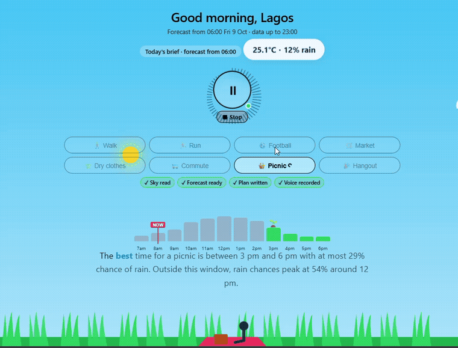

# w1-go-out-today

A local, voice-first morning brief that tells people in Lagos the best time today to be outside.




## Quick Start

### 1. Prerequisites
- Python 3.12 managed with [`uv`](https://docs.astral.sh/uv/)
- [Ollama](https://ollama.com/) running locally with `qwen2.5-coder:7b`:
  ```bash
  ollama pull qwen2.5-coder:7b
  ```

### 2. Setup
Clone the repository and install dependencies:
```bash
git clone https://github.com/G00dS0ul-Hackerton/w1-go-out-today.git
cd w1-go-out-today
uv sync
```

Copy `.env.example` to `.env` and configure your settings:
```bash
cp .env.example .env
```
Key settings:
- `ELEVENLABS_API_KEY`: Your ElevenLabs API key (required for audio; or pass `--no-voice` for text-only).
- `ELEVENLABS_VOICE_ID`: Voice ID (default: `JBFqnCBsd6RMkjVDRZzb` - George).
- `ELEVENLABS_MODEL_ID`: Model ID (default: `eleven_flash_v2_5` - 0.5 credits/char on free tier).
- `TABPFN_TOKEN`: Your TabPFN token (required on Windows to prevent browser authentication prompts).
- `OLLAMA_BASE_URL`: Ollama API endpoint (default: `http://localhost:11434`).
- `OLLAMA_MODEL`: Chosen Ollama model (default: `qwen2.5-coder:7b`).

*(Note: 3 years of hourly historical Lagos weather data is pre-bundled in `data/lagos_weather.csv`).*

### 3. Run the Morning Brief (CLI)
Generate a 12-hour TabPFN forecast table, plain-language outdoor plan, and audio brief:
```bash
uv run w1-go-out-today
```
Options:
- `--activity <activity>`: Custom outdoor activity (default: `"a walk"`), e.g. `--activity "run"` or `--activity "dry clothes"`.
- `--issue-time <timestamp>`: Specify forecast issue time (default: latest 06:00 in historical dataset), e.g. `--issue-time "2026-09-30 06:00"`.
- `--no-voice`: Skip ElevenLabs voice generation and print text only.
- `--play`: Automatically play generated audio file after generation.

### 4. Run the Web UI
Start the local web page:
```bash
uv run w1-go-out-today --serve
```
Open [http://localhost:8000](http://localhost:8000), pick your activity, and press play.

Pre-build the brief for instant playback:
```bash
uv run w1-go-out-today --prebuild
```
Runs the full pipeline (live weather → TabPFN → plan → voice) and caches the result. Schedule at 05:45 with Windows Task Scheduler for instant playback (<3s) at 06:00.

---

## Features & Architecture

### Voice by ElevenLabs
Voice generation is provided by ElevenLabs:
- Uses `eleven_flash_v2_5` by default for ultra-low latency and minimal credit cost (0.5 credits per character on free plans).
- Spoken text is formatted for natural listening: 12-hour conversational times (e.g. "4 pm"), concise sentences (~40 words total), and at most one weather number per window.
- Audio is cached locally by SHA-256 hash of `text + voice_id + model_id` under `audio/brief_<hash>.mp3`. The same text is never generated twice.
- Word timing alignments are saved to `audio/brief_<hash>.json` via the with-timestamps endpoint for synchronized captions.
- If `ELEVENLABS_API_KEY` is missing or an API error occurs, the plan text is still printed and audio is skipped with a one-line notice.
- Audio files under `audio/` are strictly excluded from git tracking.

### Prompt & Output Guard
The prompt template lives in [`prompts/plan.txt`](prompts/plan.txt). The model response is checked by an automated output guard ensuring:
1. Every numerical value mentioned maps to the forecast facts (including 12-hour times like "4 pm" = 16:00).
2. The phrase "will rain" is never used ("chance of rain" is enforced).
3. The response is strictly 2 to 3 sentences long and about 40 words max.
4. No 24-hour colon time formats (like `16:00`) are used in speech.
If the guard fails, it retries once with the model before falling back to a deterministic voice-friendly template.

### Web UI (Living Sky Scene)
- Visual living sky canvas reflecting real-time time-of-day illumination and rain conditions.
- Interactive timeline showing hourly rain probability with best window and avoid window highlights.
- Circular audio visualizer ring synchronizing speech playback with animated captions.
- "I went outside" logging button saving real outdoor trips to `data/outside_log.csv`.

### Live Weather Data
When using `--serve` or `--prebuild`, recent weather is fetched from the Open-Meteo forecast API (`past_days=2`). These recent hours are model data, not station observations.

"Demo day: Sep 30" is available offline via the CLI:
```bash
uv run w1-go-out-today --issue-time "2026-09-30 06:00" --no-voice
```

## Data Processing

To re-download historical hourly weather data for Lagos from scratch:
```bash
uv run python -m w1_go_out_today.fetch_weather
```

### Missing Data Handling
During data fetching, any hourly rows containing missing values (`null`) for any requested variables are dropped entirely.

## Forecast Evaluation

To evaluate the TabPFN model (predicting rain probability and temperature per hour) and compare it against climatology and persistence baselines:
```bash
uv run w1-go-out-today --eval
```

To run the slower `n_estimators=10` execution for comparison against default `n_estimators=2`:
```bash
uv run w1-go-out-today --eval --compare
```

To run the sample-size check across 1,000, 3,000, and 5,000 training rows:
```bash
uv run w1-go-out-today --sample-size-check
```

### Metrics (Holdout: 2026-09-01 to 2026-09-30)

| Model | Temp MAE | Rain ROC AUC | Rain Brier Score |
| --- | --- | --- | --- |
| **TabPFN (n=2)** | **0.712** | **0.733** | **0.205** |
| Climatology | 0.750 | 0.606 | 0.231 |
| Persistence | 1.608 | 0.663 | 0.322 |

*(Note: Per-lead hourly numbers output by the CLI come from exactly 30 rows each (one 06:00 issue time per day for 30 days) so they can be quite noisy).*

## Credits

- **TabPFN**: Developed by PriorLabs. Source code is licensed under Apache 2.0; model weights (TabPFN 3.5) use a non-commercial research license (see the [TabPFN License File](https://github.com/PriorLabs/TabPFN/blob/main/LICENSE)).
- **Ollama + Qwen2.5-Coder**: Local open-weight inference executed through [Ollama](https://ollama.com/), powered by `qwen2.5-coder:7b` (Qwen Team, Alibaba Cloud, under the Qwen License).
- **ElevenLabs**: Spoken voice synthesis generated using [ElevenLabs](https://elevenlabs.io/) Python SDK with the `eleven_flash_v2_5` voice model.
- **Open-Meteo**: Weather data provided by the [Open-Meteo Historical Weather API](https://open-meteo.com/en/docs/historical-weather-api) under the [CC BY 4.0](https://creativecommons.org/licenses/by/4.0/) license.

## Changes after submission
